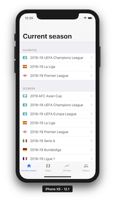

# Goalscorers for iOS

[](https://app.bitrise.io/app/50eac7265dc69fe5)

Simple viewer for football records and statistics



<a href="https://itunes.apple.com/us/app/top-goalscorers/id1448027447?mt=8" style="display:inline-block;overflow:hidden;background:url(https://linkmaker.itunes.apple.com/en-us/badge-lrg.svg?releaseDate=2019-01-04&kind=iossoftware&bubble=ios_apps) no-repeat;width:135px;height:40px;"></a>

## Requirement

- Xcode 10.1
- Ruby
  - bundler
- Carthage

## Installation

### Dependencies

```bash
bundle
bundle exec pod install
carthage bootstrap --platform iOS
```

### Firebase

1. Create a Firebase project.
2. Download `GoogleService-info.plist`.
