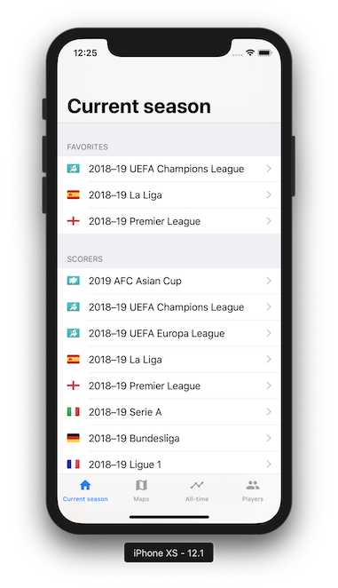

# Goalscorers for iOS

[](https://app.bitrise.io/app/50eac7265dc69fe5)

Simple viewer for football records and statistics



<div>
  <a href="https://itunes.apple.com/us/app/id1448027447"></img></a>
</div>

## Requirement

- Xcode 10.1
- Ruby
  - bundler
- Carthage

## Installation

### Dependencies

```bash
bundle
bundle exec pod install
carthage bootstrap --platform iOS
```

### Firebase

1. Create a Firebase project.
2. Download `GoogleService-info.plist`.
